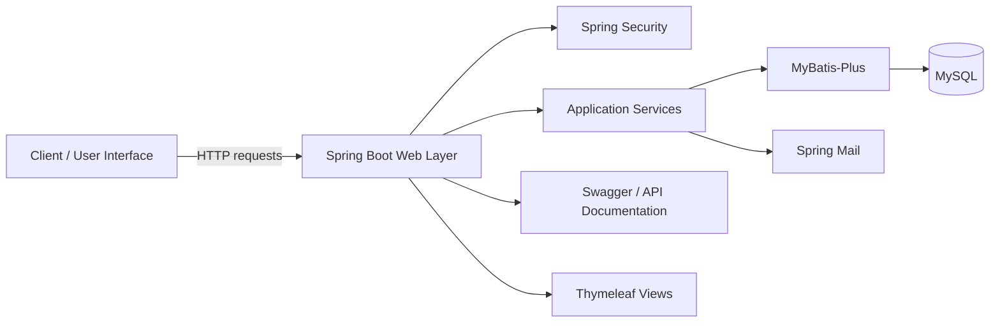

<div align="center">

# HealthCare — 软件天使
### University Software Innovation Competition Project


</div>

## Overview

**软件天使 (HealthCare)** is a healthcare-oriented software project developed for a university software innovation competition. The repository preserves the original backend implementation and engineering materials created by the team. It represents an early full-stack/service-oriented software project in my undergraduate portfolio.

The backend is a Maven-based **Spring Boot** application that integrates web APIs, security, relational persistence, template rendering, email, API documentation, and supporting utility libraries.

## Team

- **Bo Liu**
- **Zeng Yiyun**
- **Sun Xun**

This is a collaborative project; the repository is presented as team work rather than as an individual implementation.

## System Architecture



## Technology Stack

The original `healthcare/pom.xml` includes:

| Layer | Technology |
| --- | --- |
| Language | Java 8 |
| Web framework | Spring Boot 2.6.6 / Spring Web |
| Authentication / authorization | Spring Security |
| Persistence | MyBatis-Plus |
| Database | MySQL |
| Server-side templates | Thymeleaf |
| API documentation | Swagger 2 / Springfox |
| Email | Spring Mail |
| Utilities | Hutool, FastJSON, Apache HttpClient |
| Build system | Maven |

## Project Goals

The project explores a digital workflow for everyday healthcare-service scenarios. From an engineering perspective, the main learning goals were to combine a realistic domain scenario with a multi-layer backend stack:

- user/account-oriented web services;
- authenticated service access;
- relational data management;
- modular service and persistence layers;
- email-related workflows;
- API documentation and testing;
- team-based software development.

## Repository Structure

```text
HealthCare/
├── healthcare/
│   ├── pom.xml                 # Maven configuration and dependencies
│   ├── src/                    # Main application source
│   └── .idea/                  # Original IntelliJ project metadata
└── README.md
```

## Running the Backend

```bash
cd healthcare
mvn clean package
mvn spring-boot:run
```

Before running the original application on a new machine, inspect and update the configuration under `src/` for:

- MySQL connection information;
- mail server credentials/settings;
- local file paths;
- service ports and hostnames.

Because this is a historical competition repository, dependency versions and configuration reflect the environment used during development.

## Engineering Notes

The repository contains IDE-specific files and original competition-stage configuration. For a cleaner modern reproduction, it is preferable to import the Maven project into a fresh IDE workspace and keep secrets or machine-specific settings outside source control.

## Portfolio Context

This project documents an earlier stage of my software-engineering development. My later research gradually moved from software systems toward **graph learning, spatiotemporal intelligence, LLM-based semantic reasoning, and Agentic AI**, but this project remains useful as evidence of full-stack/team engineering experience.

## Contact

For questions about this repository, please contact **Bo Liu** at `liubo317@hnu.edu.cn`.  
Homepage: https://boliupro.github.io
